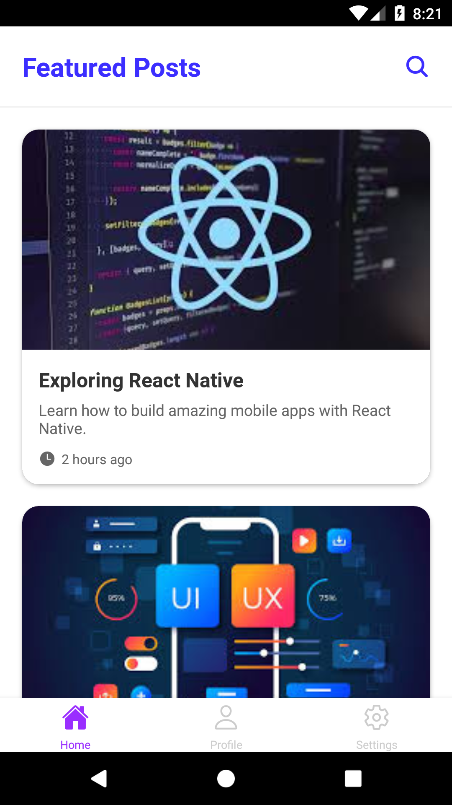
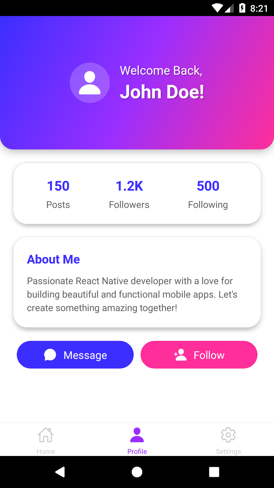
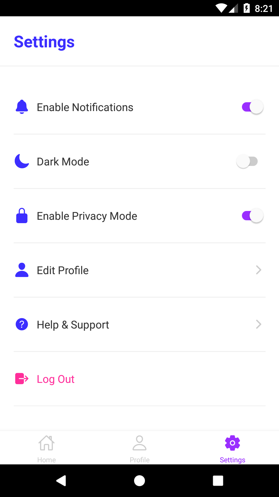

# TabNav

TabNav is a React Native app that demonstrates **bottom tab navigation** using **React Navigation**. It includes three main screens: **Home**, **Profile**, and **Settings**, each with its own functionality and design.

## Features

- **Bottom Tab Navigation**: Smooth and intuitive navigation between screens.
- **Custom Icons**: Uses Ionicons for tab icons.
- **Modern UI**: Clean and visually appealing design with gradients and shadows.
- **Responsive Layout**: Works seamlessly on both iOS and Android.

## Screens

1. **Home Screen**: Displays featured content (e.g., posts with titles, descriptions, and images).
2. **Profile Screen**: Shows user profile details, including a profile picture, name, bio, and stats.
3. **Settings Screen**: Allows users to configure app settings (e.g., notifications, dark mode).

## Technologies Used

- **React Native**: For building the mobile app.
- **React Navigation**: For implementing bottom tab and stack navigation.
- **Expo Vector Icons**: For using Ionicons in the app.
- **Expo Linear Gradient**: For creating gradient backgrounds.

## How to Run the App Locally

Follow these steps to run the app on your local machine:

### Prerequisites

- Node.js and npm installed.
- Expo CLI installed globally (npm install -g expo-cli).
- A mobile device or emulator to run the app.

### Steps

1. **Clone the repository**:

```bash
git clone https://github.com/RaidenOM/TabNav.git
cd UserDeck
```

2. **Install dependencies**:

```bash
npm install
```

3. **Start the development server**:

```bash
expo start
```

4. **Run the app**:

- Use the Expo Go app on your mobile device to scan the QR code displayed in the terminal.
- Alternatively, use an Android/iOS emulator to run the app.

## How to build the APK

To build a release-ready APK for Android using **EAS**, follow these steps:

1. **Install Expo CLI** (if not already installed):

```bash
npm install -g expo-cli
```

2. **Log in to Expo**:

```bash
expo login
```

3. **Build the APK**:

```bash
expo build:android
```

4. **Follow the Prompts**:

   - Choose the build type (e.g., APK or App Bundle).

   - Wait for the build process to complete. This may take a few minutes.

5. **Download the APK**:

   - Once the build is complete, you’ll receive a link to download the APK.

   - Alternatively, you can download it using:
     ```bash
     expo build:status
     ```

6. **Install the APK**:
   - Transfer the APK to your Android device and install it.

## Screenshots




